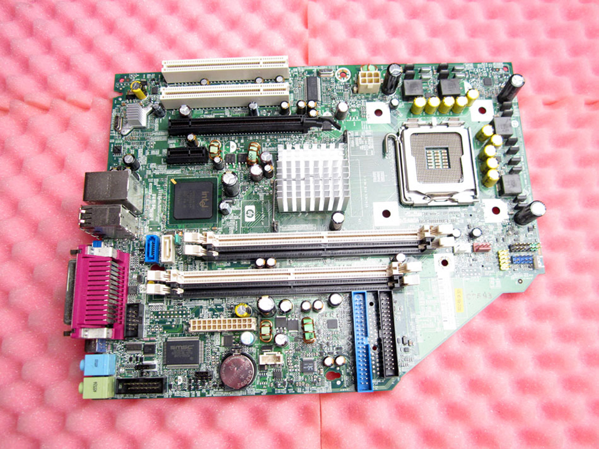
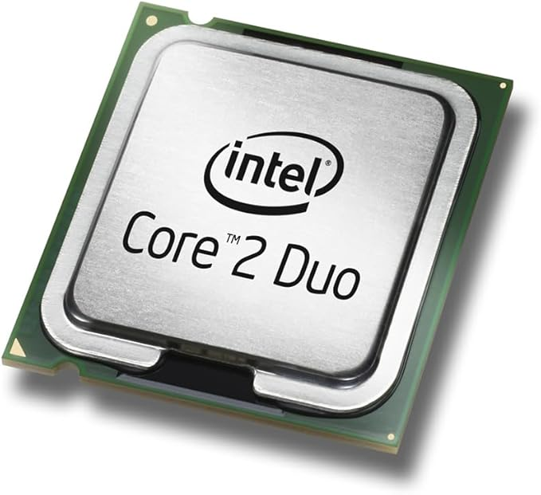
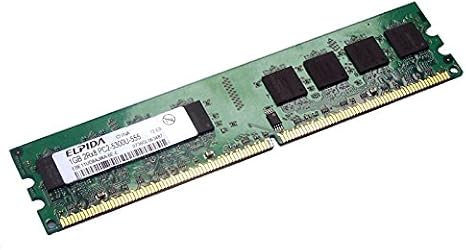
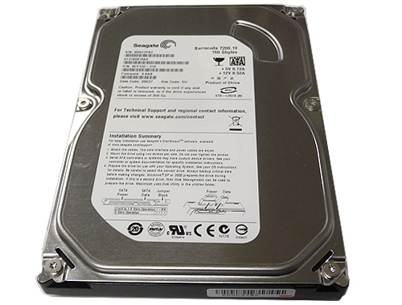
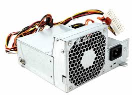

# 10 — Toma de datos (taller)

> Inserta fotos en `assets/img/10-toma_de_datos/` y enlázalas aquí con rutas relativas.

| Componente | Marca/Fabricante | Modelo/Serie | Características técnicas visibles | Foto |
|---|---|---|---|---|
| **Placa base** | HP | Compaq dc7600 / P30490C9VV9RAL | 4 slots RAM |  |
| **Microprocesador** | Intel | Core(TM)2 DuoCPU E6750 | - |  |
| **Memoria RAM** | ELPIDA | EBE11UP8AGWA-6E-E | ddr2 / 667mhz 1gb |  |
| **Disco HDD/SSD** | SEAGATE BARRACUDA | GRX1FPMH / ST316081SAS | Interfaz (SATA/M.2), Capacidad |  |
| **Fuente de alimentación** | HP | DPS-240MB-1 A | Potencia (W), Certificación (80+) |  |
| **Otros (GPU/Tarjetas)** | GPU Silicon Image / BELKIN D ATG / EXPANSION FIREWIRE 400 | Sill 1364 / - / - | x16 / - / - |  |
