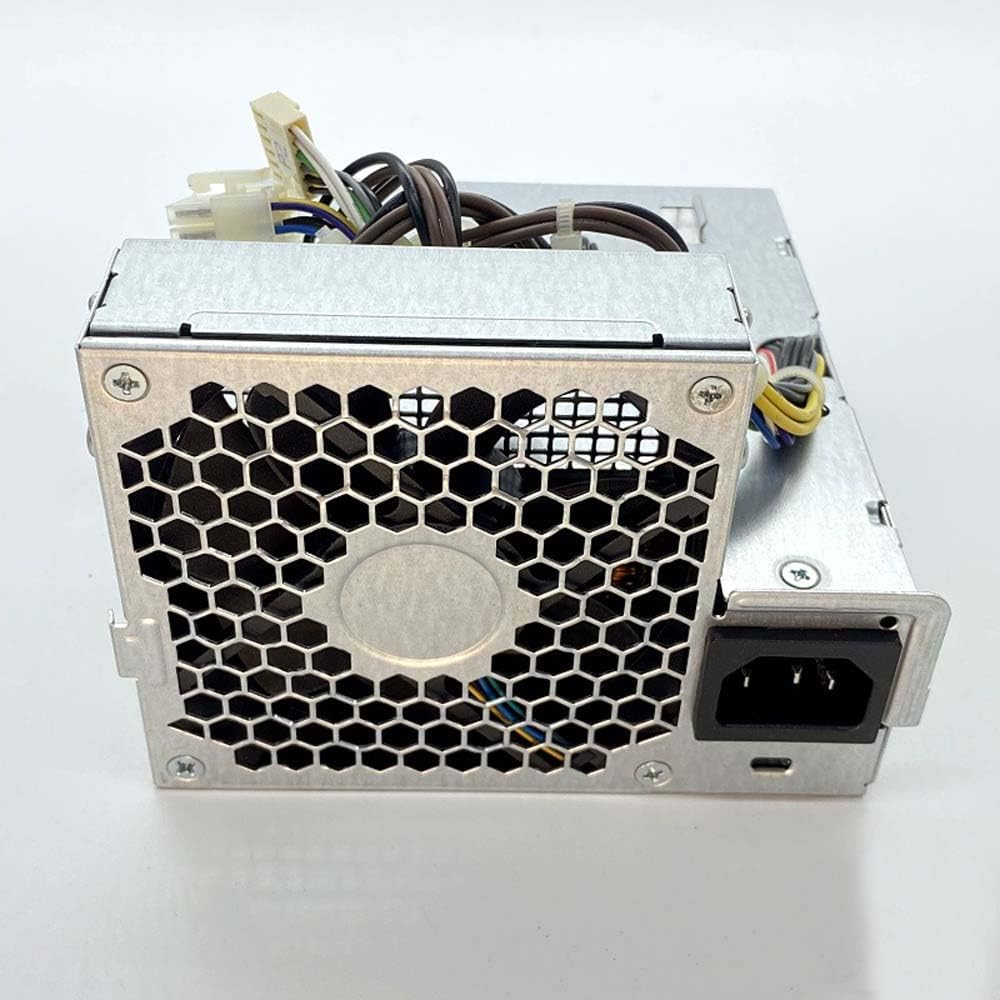
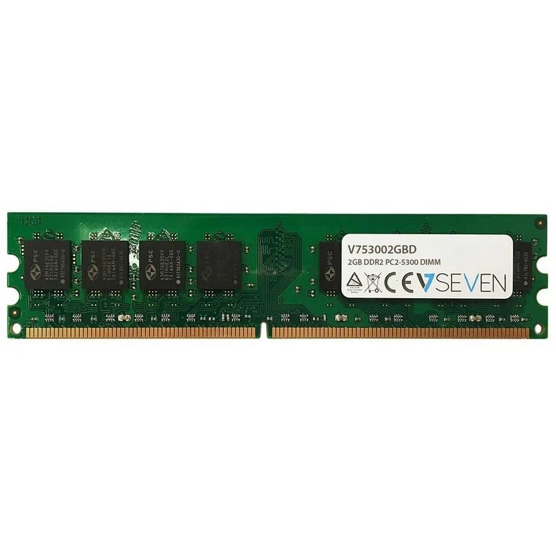
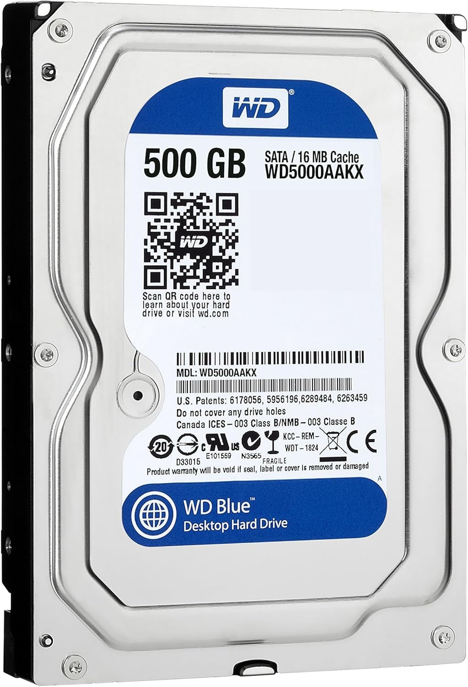

# 30 — Mercado y recambios

> Imagina que el equipo falla. Selecciona **tres** componente para recambio.

- **Componente a sustituir:**  Fuente de alimentación HP DPS-240MB-1 A
- **¿Existe el mismo modelo exacto en tiendas?** Si
- **Alternativa compatible (socket/ranura):** Oumauga Fuente de Alimentación de 240W D10-240P1A
- **Precio aproximado (€):**  50€
- **URL:**  https://www.amazon.es/dp/B0DJ1JHKWM?source=ps-sl-shoppingads-lpcontext&psc=1&smid=A2BVEQS3QKV3ZL
- **Captura:** 

**Justificación breve:** Sus especificaciones y conectores son iguales/similares

- **Componente a sustituir:**  Módulo RAM DDR2 1 GB Elpida DDR2-667
- **¿Existe el mismo modelo exacto en tiendas?** Si  
- **Alternativa compatible (socket/ranura):**  Memoria RAM V7 V753002GBD DDR2 667 PC2-5300 2GB CL5
- **Precio aproximado (€):**  10€
- **URL:**  https://www.pccomponentes.com/v7-v753002gbd-ddr2-667-pc2-5300-2gb-cl5
- **Captura:** 

**Justificación breve:** Sus especificaciones y conectores son iguales/similares

- **Componente a sustituir:**  Disco Seagate Barracuda ST316081SAS (SATA)
- **¿Existe el mismo modelo exacto en tiendas?** Si
- **Alternativa compatible (socket/ranura):**  Western Digital - Blue 500gb 500gb sata - Disco Duro (sata, Unidad de Disco Duro, rohs, 0-60 °c, -40-65 °c, DC 12v)
- **Precio aproximado (€):**  30€
- **URL:**  https://www.amazon.es/Western-digital-500gb-Unidad-40-65/dp/B00ZQG4JXM?source=ps-sl-shoppingads-lpcontext&psc=1&smid=A1JH1IGZD3GF7P
- **Captura:** 

**Justificación breve:** Sus especificaciones y conectores son iguales/similares
