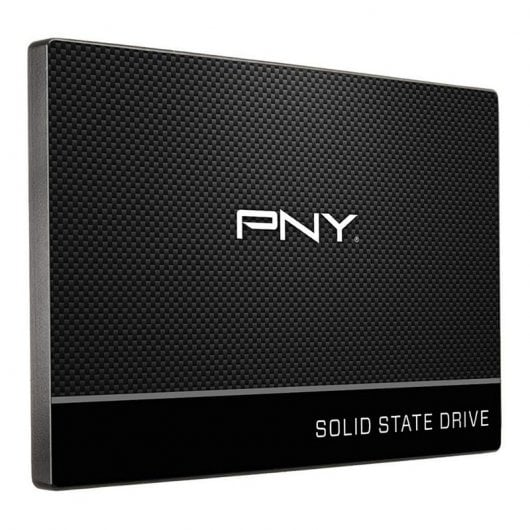
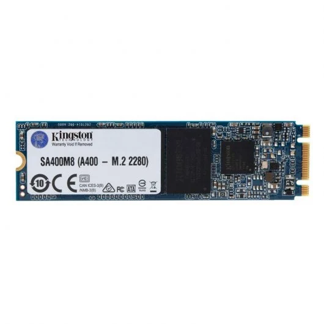
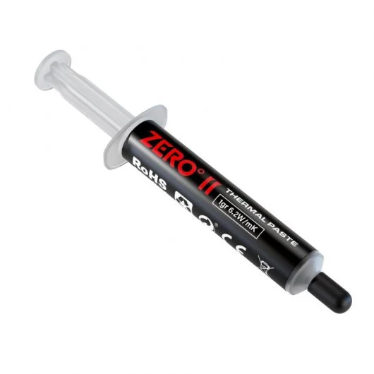
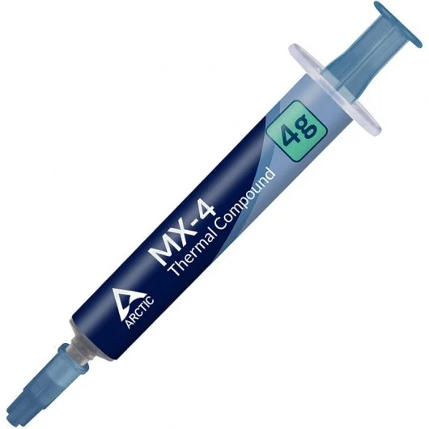

# 30 — Búsqueda y selección de mejoras de **hardware**

> **Objetivo:** Encontrar las **mejoras mínimas** que conviertan cada PC en **usable** para el centro de mayores, **respetando el escenario S1 (≤ 15 €)**.

## 1) Piezas candidatas (con enlaces y capturas)

### SSD 2.5" para almacenamiento

| Categoría | Marca/Modelo                  | Capacidad | Precio (€) | Tienda           | URL                                                                 | Captura            |
|------------|-------------------------------|-----------:|-----------:|------------------|---------------------------------------------------------------------|--------------------|
| SSD        | PNY CS900 2.5"               | 120 GB    | 18,50      | PcComponentes    | https://www.pccomponentes.com/pny-cs900-25-120gb-ssd-sata-3-tlc      |  |
| SSD        | Kingston A400 SSD 120 GB     | 120 GB    | 25,49      | PcComponentes    | https://www.pccomponentes.com/kingston-a400-ssd-120gb-m2-sata-iii-tlc | |

## Mantenimiento y pasta térmica

| Categoría     | Marca/Modelo                  | Contenido | Precio (€) | Tienda        | URL                                             | Captura             |
|---------------|-------------------------------|-----------:|-----------:|---------------|-------------------------------------------------|---------------------|
| Pasta térmica | Temperst Zero II              | 1 g        | 1,98       | PcComponentes | https://www.pccomponentes.com/tempest-zero-ii-pasta-termica-1g-62w-mk     |  |
| Pasta térmica | Arctic MX-4 4 g               | 4 g        | 7,09       | PcComponentes | https://www.pccomponentes.com/arctic-mx-4-pasta-termica-4-gramos     |  |

> Se puede usar la pasta Artic en mas de un ordenador para abaratar costes

## 2) Compatibilidad técnica (justificación simplificada)

- **SSD SATA 2.5":** Las unidades PNY CS900 y Kingston A400 están en formato 2.5" y utilizan **interfaz SATA III retrocompatible con SATA II** típico de placas antiguas, por lo que encajan en bahías libres o con adaptador 2.5"→3.5". Las placas estándar de sobremesa con puertos SATA admiten sin problema estos SSD.
- **Pasta térmica:** La pasta térmica genérica (p. ej., Temperst Zero II o Arctic MX-4) es compatible con **cualquier disipador y CPU de sobremesa estándar**, aplicándose entre el procesador y su disipador para mejorar transferencia de calor y disminuir temperaturas.

## 3) Mini-estimación de impacto

- **SSD 120 GB:** Sustituir un HDD por un SSD reduce drásticamente los tiempos de arranque del sistema y la apertura de aplicaciones, lo que se traduce en una respuesta aparente mucho más rápida incluso en hardware antiguo.  
- **Pasta térmica + limpieza:** Renovar la pasta térmica y limpiar el polvo del disipador mejora la disipación térmica, reduciendo temperatura y ruido, lo que favorece estabilidad general sin impactar en rendimiento bruto.

## 4) Escenario elegido y desglose de gasto (S1)

| Escenario | Pieza          | Precio (€) | Unidades | Subtotal (€) | Nota                                          |
|-----------|----------------|-----------:|---------:|-------------:|-----------------------------------------------|
| S2        | SSD 120 GB     | 18,50      | 1        | 18,50        | PNY CS900 (mejor relación calidad-precio)     |
| S2        | Pasta térmica  | 1,98       | 1        | 1,98         | Temperst Zero II (compartido entre PCs)       |
|            |               |            |          |              |                                               |
| **Total HW** |             |            |          | **20,48**    | Puede ajustarse con oferta o 2ª mano          |

Luego traslada el **Total HW** a `75-plan_presupuesto_hw_y_roi.md` para calcular costes y ROI.
