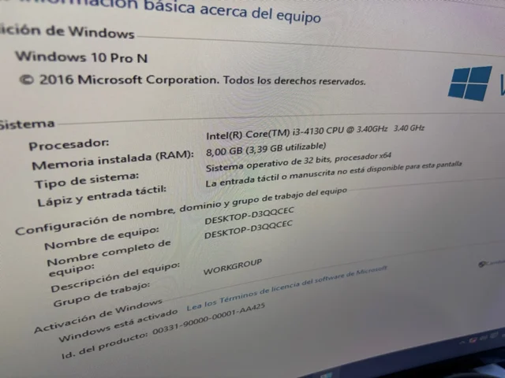
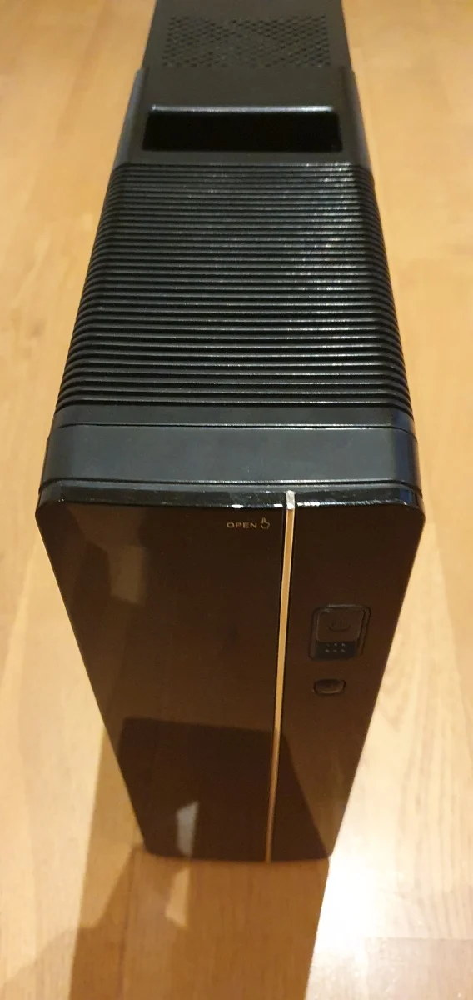
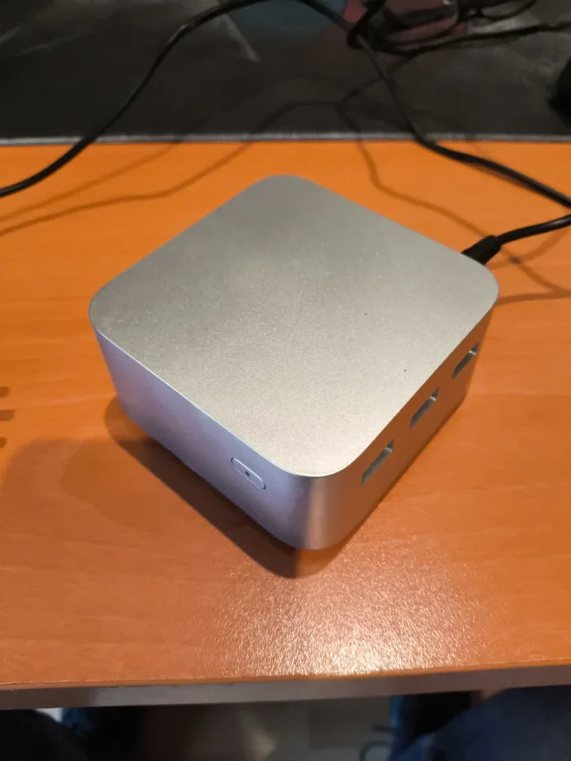

# 65 — Análisis de mercado y PVP

## Comparables (3 mínimos)

| Plataforma | Enlace | Captura | Precio (€) | Especificación | Fecha/Hora |
|---|---|---|---:|---|---|
| Wallapop | https://www.wallapop.com/item/pc-hp-i3-4-gen-8gb-ram-ssd-120gb-1151194633 |  | 45 | PC HP i3 4ª Gen, 8GB RAM, SSD 120GB | 2026‑02‑08 10:30 |
| Wallapop | https://www.wallapop.com/item/pc-intel-i3-3-40ghzs-8gb-ram-120-ssd-1000-hdd-1067395336 |  | 64.99 | PC Asus i3, 8GB RAM, SSD 120GB + HDD 1TB | 2026‑02‑08 11:15 |
| Wallapop | https://uk.wallapop.com/item/mini-pc-n100-8gb-ram-128gb-ssd-plata-1192688594 |  | 80 | Mini PC N100, 8GB RAM, SSD 128GB | 2026‑02‑08 10:50 |

## PVP objetivo

- **Media precios comparables:** (45 + 64.99 + 80) / 3 ≈ **63.3 €**  
- **Margen de competitividad:** 15 %  
- **PVP objetivo:** 63.3 € − 15 % ≈ **53.8 €**

