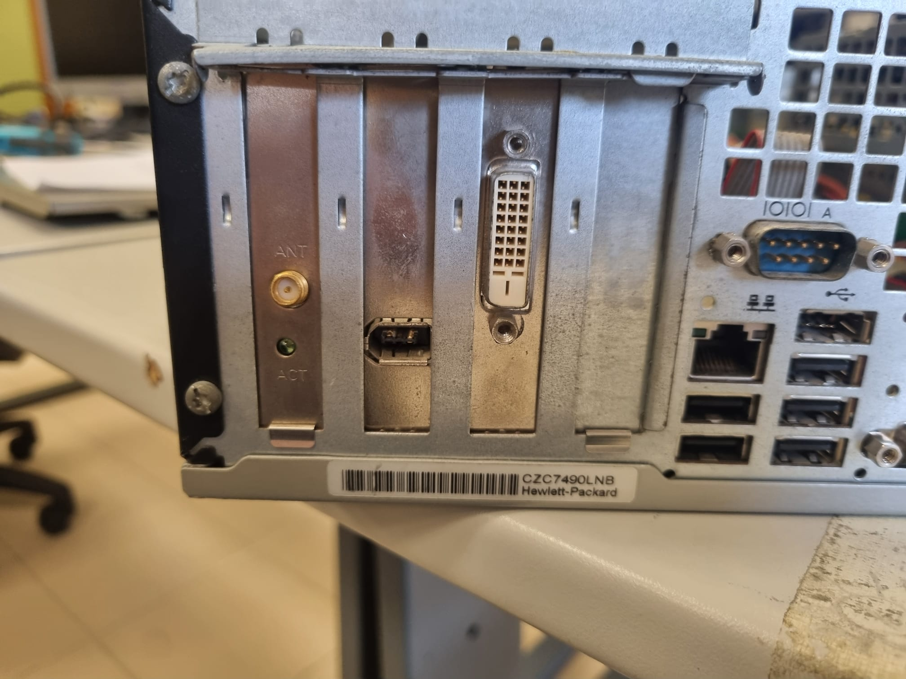
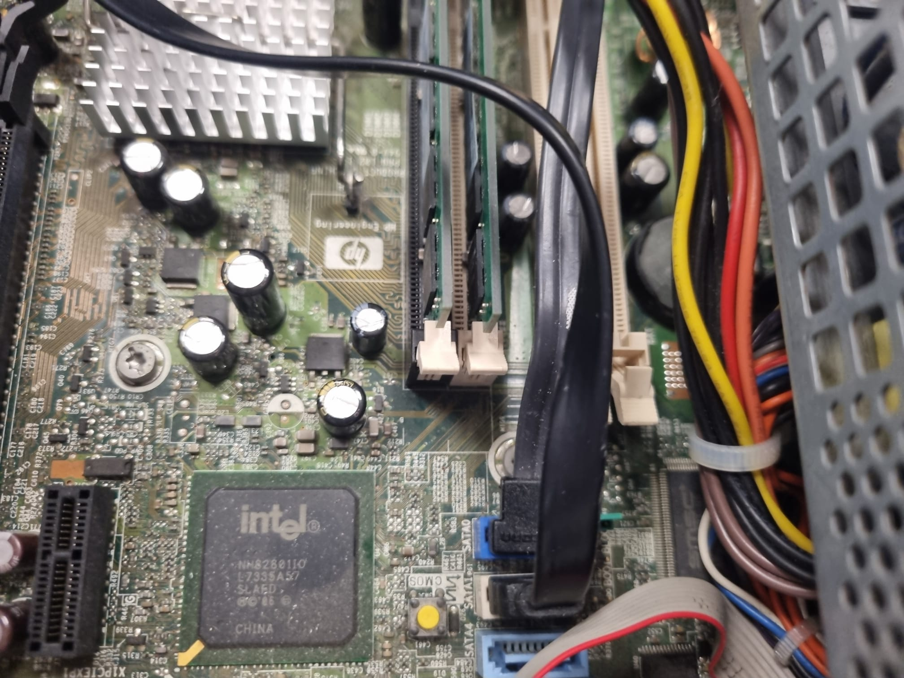

# 90 — ENTREGA ÚNICA (PDF)

# 00 — Portada

- **Alumno/a:** Pablo Garcia Villanueva  
- **Grupo:**  1º ASIR
- **Reto:** Puesta a Punto Low-Cost y Competitiva (Centro de Mayores) — **FOCO EN HARDWARE**  
- **Fecha:**  2026-02-08

# 02 — Contexto y requisitos

El objetivo de este reto es reacondicionar una flota de PCs adquiridos por 20 € la unidad para su uso en un centro de mayores, asegurando que sean equipos usables para navegación web, correo electrónico, videollamadas y ofimática online mediante un micro-upgrade de hardware.  
La restricción principal es el presupuesto máximo altamente limitado.  
Como criterios de éxito, se considera fundamental que la mejora sea claramente perceptible para el usuario final, que todas las piezas utilizadas sean compatibles y estén correctamente justificadas con fuentes técnicas, y que el coste total por unidad resulte competitivo frente a equipos equivalentes del mercado.

# 10 — Diagnóstico inicial del lote

| ID Equipo | CPU / Socket | RAM Instalada / Máx | Almacenamiento | Ranuras/Bahías Libres | Observaciones (Estado físico y térmico) |
| :--- | :--- | :--- | :--- | :--- | :--- |
| **Equipo 01** | Intel Core 2 Duo E6750 / LGA775 | 4 GB DDR2 / 8 GB | HDD 160 GB (Samsung) | 0 slots RAM / 1 bahía 3.5" | Polvo residual y cables que podrian estar mejor gestionados |
| **Equipo 02** | Intel Core 2 Duo E6750 / LGA775 | 4 GB DDR2 / 8 GB | HDD 160 GB (Samsung) | 0 slots RAM / 1 bahía 3.5" | Polvo residual y mala gestion de los cables internos |
| **Equipo 03** | Intel Core 2 Duo E6750 / LGA775 | 1 GB DDR2 / 8 GB | HDD 160 GB (Seagate) | 3 slots RAM / 1 bahía 3.5" | Fallo en pila CMOS y chasis deformado o atascado |
| **Equipo 04** | Intel Core 2 Duo E6750 / LGA775 | 1 GB DDR2 / 8 GB | HDD 160 GB (Seagate) | 3 slots RAM / 1 bahía 3.5" | Pasta térmica muy degradada y suciedad interna |
| **Equipo 05** | Intel Core 2 Duo E6750 / LGA775 | 1 GB DDR2 / 8 GB | HDD 160 GB (Seagate) | 2 slots RAM / 1 bahía 3.5" | Mucho polvo acumulado y falta antena wifi |

**Capturas:** 

# 30 — Búsqueda y selección de mejoras de **hardware**

> **Objetivo:** Encontrar las **mejoras mínimas** que conviertan cada PC en **usable** para el centro de mayores, **respetando el escenario S1 (≤ 15 €)**.

## 1) Piezas candidatas (con enlaces y capturas)

### SSD 2.5" para almacenamiento

| Categoría | Marca/Modelo                  | Capacidad | Precio (€) | Tienda           | URL                                                                 | Captura            |
|------------|-------------------------------|-----------:|-----------:|------------------|---------------------------------------------------------------------|--------------------|
| SSD        | PNY CS900 2.5"               | 120 GB    | 18,50      | PcComponentes    | https://www.pccomponentes.com/pny-cs900-25-120gb-ssd-sata-3-tlc      |  |
| SSD        | Kingston A400 SSD 120 GB     | 120 GB    | 25,49      | PcComponentes    | https://www.pccomponentes.com/kingston-a400-ssd-120gb-m2-sata-iii-tlc | |

## Mantenimiento y pasta térmica

| Categoría     | Marca/Modelo                  | Contenido | Precio (€) | Tienda        | URL                                             | Captura             |
|---------------|-------------------------------|-----------:|-----------:|---------------|-------------------------------------------------|---------------------|
| Pasta térmica | Temperst Zero II              | 1 g        | 1,98       | PcComponentes | https://www.pccomponentes.com/tempest-zero-ii-pasta-termica-1g-62w-mk     |  |
| Pasta térmica | Arctic MX-4 4 g               | 4 g        | 7,09       | PcComponentes | https://www.pccomponentes.com/arctic-mx-4-pasta-termica-4-gramos     |  |

> Se puede usar la pasta Artic en mas de un ordenador para abaratar costes

## 2) Compatibilidad técnica (justificación simplificada)

- **SSD SATA 2.5":** Las unidades PNY CS900 y Kingston A400 están en formato 2.5" y utilizan **interfaz SATA III retrocompatible con SATA II** típico de placas antiguas, por lo que encajan en bahías libres o con adaptador 2.5"→3.5". Las placas estándar de sobremesa con puertos SATA admiten sin problema estos SSD.
- **Pasta térmica:** La pasta térmica genérica (p. ej., Temperst Zero II o Arctic MX-4) es compatible con **cualquier disipador y CPU de sobremesa estándar**, aplicándose entre el procesador y su disipador para mejorar transferencia de calor y disminuir temperaturas.

## 3) Mini-estimación de impacto

- **SSD 120 GB:** Sustituir un HDD por un SSD reduce drásticamente los tiempos de arranque del sistema y la apertura de aplicaciones, lo que se traduce en una respuesta aparente mucho más rápida incluso en hardware antiguo.  
- **Pasta térmica + limpieza:** Renovar la pasta térmica y limpiar el polvo del disipador mejora la disipación térmica, reduciendo temperatura y ruido, lo que favorece estabilidad general sin impactar en rendimiento bruto.

## 4) Escenario elegido y desglose de gasto (S1)

| Escenario | Pieza          | Precio (€) | Unidades | Subtotal (€) | Nota                                          |
|-----------|----------------|-----------:|---------:|-------------:|-----------------------------------------------|
| S2        | SSD 120 GB     | 18,50      | 1        | 18,50        | PNY CS900 (mejor relación calidad-precio)     |
| S2        | Pasta térmica  | 1,98       | 1        | 1,98         | Temperst Zero II (compartido entre PCs)       |
|            |               |            |          |              |                                               |
| **Total HW** |             |            |          | **20,48**    | Puede ajustarse con oferta o 2ª mano          |

Luego traslada el **Total HW** a `75-plan_presupuesto_hw_y_roi.md` para calcular costes y ROI.

# 65 — Análisis de mercado y PVP

## Comparables (3 mínimos)

| Plataforma | Enlace | Captura | Precio (€) | Especificación | Fecha/Hora |
|---|---|---|---:|---|---|
| Wallapop | https://www.wallapop.com/item/pc-hp-i3-4-gen-8gb-ram-ssd-120gb-1151194633 |  | 45 | PC HP i3 4ª Gen, 8GB RAM, SSD 120GB | 2026‑02‑08 10:30 |
| Wallapop | https://www.wallapop.com/item/pc-intel-i3-3-40ghzs-8gb-ram-120-ssd-1000-hdd-1067395336 |  | 64.99 | PC Asus i3, 8GB RAM, SSD 120GB + HDD 1TB | 2026‑02‑08 11:15 |
| Wallapop | https://uk.wallapop.com/item/mini-pc-n100-8gb-ram-128gb-ssd-plata-1192688594 |  | 80 | Mini PC N100, 8GB RAM, SSD 128GB | 2026‑02‑08 10:50 |

## PVP objetivo

- **Media precios comparables:** (45 + 64.99 + 80) / 3 ≈ **63.3 €**  
- **Margen de competitividad:** 15 %  
- **PVP objetivo:** 63.3 € − 15 % ≈ **53.8 €**

# 75 — Plan de presupuesto (HW) y ROI

> Tras decidir **S2** en `30-busqueda_mejoras_hw.md`, se completa costes y ROI.

- **Tarifa interna:** 10 €/h  
- **Horas por equipo:** 0,5 h (instalación SSD + RAM + pasta térmica + limpieza)

| Escenario | Gasto HW (€) | Horas | Tarifa (€/h) | **Coste total (€)** | **PVP objetivo (€)** | **ROI** | ¿Competitivo? |
|-----------|-------------:|------:|-------------:|------------------:|-------------------:|--------:|---------------|
| S0        | 0            | 0,5   | 10           | 20 + 0 + (0,5×10) = 25 | 53,5              | (53,5-25)/25 ≈ 1,14 (114 %) | Sí |
| S1        | 20,48        | 0,5   | 10           | 20 + 20,48 + (0,5×10) = 45,48 | 53,5              | (53,5-45,48)/45,48 ≈ 0,18 (18 %) | Sí |
| S2        | 28,00        | 0,5   | 10           | 20 + 28 + (0,5×10) = 43 | 53,5              | (53,5-43)/43 ≈ 0,24 (24 %) | Sí |

**Elección final y motivos:**  
Se selecciona **S2** porque proporciona una mejora significativa del rendimiento (SSD + RAM + pasta térmica) con **coste total dentro del límite del escenario** y un ROI positivo, manteniendo el precio competitivo frente al PVP objetivo.
