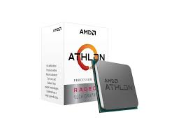
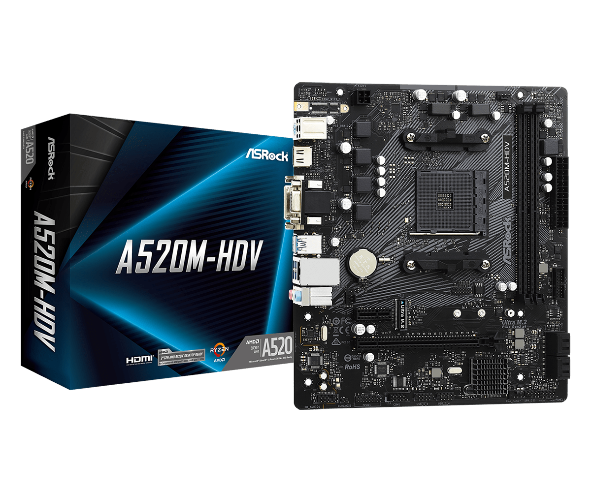
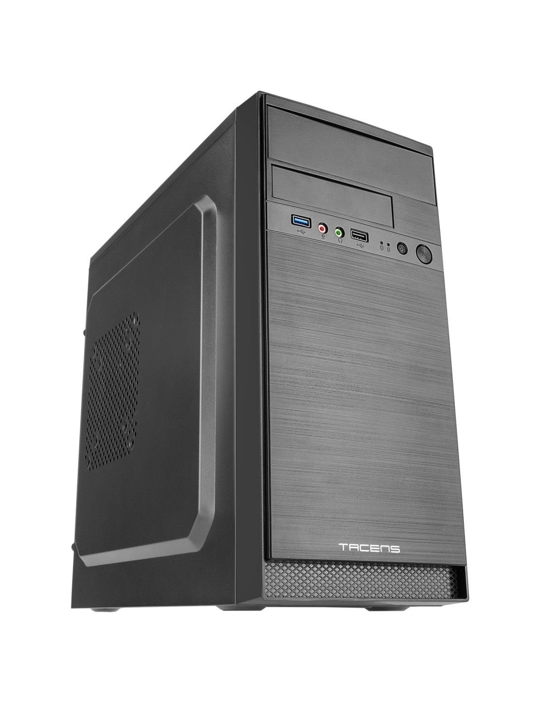

# Opción A — PC de oficina por piezas (PASO 1–7)

> Rellena cada paso usando la **plantilla**. Mantén el objetivo: **oficina**, precio ajustado y componentes razonables.

---

## PASO 1 — CPU con gráficos integrados
**Componente elegido:**  
- **Marca y modelo:**  AMD Athlon 3000G  
- **Precio (€):**  33.57€  
- **URL tienda:**  https://www.pccomponentes.com/procesador-amd-athlon-3000g-2-nucleos-35-ghz-graficos-integrados-radeon-vega-3  

**Ficha técnica oficial (obligatorio):**  
- https://www.amd.com/es/support/downloads/drivers.html/processors/athlon/athlon-3000-series/amd-athlon-3000g.html#amd_support_product_spec  

**Características principales (resumen):**
- 2 núcleos / 4 hilos  
- Frecuencia base de 3.5 GHz  
- Gráficos integrados Radeon Vega 3  
- Socket AM4  
- TDP de 35W  

**Justificación (oficina):**
- Con la prioridad siendo el precio más bajo posible dentro de unos mínimos de calidad esta CPU ofrece todo lo necesario para un ordenador de oficina con la ofimática como principal actividad. Incluye gráficos integrados, por lo que no es necesaria tarjeta gráfica dedicada.

**Compatibilidad (obligatorio, con enlaces):**
- Compatibilidad clave 1 (Socket AM4):  
  - Evidencia (URL): https://www.amd.com/es/support/downloads/drivers.html/processors/athlon/athlon-3000-series/amd-athlon-3000g.html#amd_support_product_spec  
- Compatibilidad clave 2 (Soporte memoria DDR4):  
  - Evidencia (URL): https://www.amd.com/es/support/downloads/drivers.html/processors/athlon/athlon-3000-series/amd-athlon-3000g.html#amd_support_product_spec  

**Captura (opcional si tu profe lo exige):**

---

## PASO 2 — Placa base compatible
**Componente elegido:**  
- **Marca y modelo:** ASRock A520M-HDV  
- **Precio (€):** 52.99€  
- **URL tienda:** https://www.pccomponentes.com/asrock-a520m-hdv  

**Ficha técnica oficial (obligatorio):**  
- https://asrock.com/MB/AMD/A520M-HDV/index.es.asp  

**Características principales (resumen):**
- Socket AM4  
- Chipset A520  
- 2 slots DDR4 hasta 64GB  
- 1x M.2 NVMe  
- 4x SATA3  
- Formato Micro-ATX  

**Justificación (oficina):**
- Buscando un precio bajo junto con un punto a la posible mejora a futuro esta placa base ofrece eso y te asegura una base mejorable que perdura en el tiempo sin necesidad de actualizarla.

**Compatibilidad (obligatorio, con enlaces):**
- Compatibilidad clave 1 (Soporte Socket AM4 compatible con Athlon 3000G):  
  - Evidencia (URL): https://asrock.com/MB/AMD/A520M-HDV/index.es.asp  
- Compatibilidad clave 2 (Soporte DDR4 hasta 64GB):  
  - Evidencia (URL): https://asrock.com/MB/AMD/A520M-HDV/index.es.asp  

**Captura (opcional si tu profe lo exige):**

---

## PASO 3 — Memoria RAM (mínimo 8 GB)
**Componente elegido:**  
- **Marca y modelo:** Corsair Vengeance LPX DDR4 2400Hz PC4-19200 16GB CL14  
- **Precio (€):** 138.15€  
- **URL tienda:** https://www.pccomponentes.com/corsair-vengeance-lpx-ddr4-2400-pc4-19200-16gb-cl14  

**Ficha técnica oficial (obligatorio):**  
- https://www.corsair.com/es/es/p/memory/cmk16gx4m1a2400c14/vengeancea-lpx-16gb-1-x-16gb-ddr4-dram-2400mhz-c14-memory-kit-black-cmk16gx4m1a2400c14#tab-techspecs  

**Características principales (resumen):**
- 16GB (1x16GB)  
- DDR4 2400 MHz  
- Latencia CL14  
- Voltaje 1.2V  
- Formato DIMM  

**Justificación (oficina):**
- Pese a que 8GB son suficientes la gente que desconoce de ordenadores tiende a impacientarse por ende con esta RAM priorizamos los GB a cambio de sacrificar latencia y frecuencia que no son necesarias en ofimática o en navegación web.

**Compatibilidad (obligatorio, con enlaces):**
- Compatibilidad clave 1 (Memoria DDR4 compatible con placa A520M-HDV):  
  - Evidencia (URL): https://asrock.com/MB/AMD/A520M-HDV/index.es.asp  
- Compatibilidad clave 2 (Frecuencia soportada por Athlon 3000G):  
  - Evidencia (URL): https://www.amd.com/es/support/downloads/drivers.html/processors/athlon/athlon-3000-series/amd-athlon-3000g.html#amd_support_product_spec  

**Captura (opcional si tu profe lo exige):**

 

---

## PASO 4 — Almacenamiento (SSD)
**Componente elegido:**  
- **Marca y modelo:** Kingston A400 240Gb  
- **Precio (€):** 67.95€  
- **URL tienda:** https://www.pccomponentes.com/disco-duro-kingston-a400-240gb-disco-ssd-sata3-500mb-s  

**Ficha técnica oficial (obligatorio):**  
- https://www.kingston.com/es/ssd/a400-solid-state-drive  

**Características principales (resumen):**
- 240GB  
- Interfaz SATA III 6Gb/s  
- Velocidad lectura hasta 500MB/s  
- Formato 2.5”  

**Justificación (oficina):**
- En caso de una oficina se prioriza la velocidad en cuanto a la finalización de los procesos. Se prioriza un disco SSD ante uno HDD ya que se trabaja con archivos ligeros y se mejora mucho la rapidez del sistema.

**Compatibilidad (obligatorio, con enlaces):**
- Compatibilidad clave 1 (Interfaz SATA III soportada por la placa base):  
  - Evidencia (URL): https://asrock.com/MB/AMD/A520M-HDV/index.es.asp  
- Compatibilidad clave 2 (Formato 2.5” estándar):  
  - Evidencia (URL): https://www.kingston.com/es/ssd/a400-solid-state-drive  

**Captura (opcional si tu profe lo exige):**

---

## PASO 5 — Fuente (PSU)
**Componente elegido:**  
- **Marca y modelo:** Gigabyte 650W Modelo P650G  
- **Precio (€):** 63.45€  
- **URL tienda:** https://www.pccomponentes.com/fuente-alimentacion-fuente-de-alimentacion-gigabyte-650w-80-plus-gold-modelo-p650g-enfriamiento-activo  

**Ficha técnica oficial (obligatorio):**  
- https://www.gigabyte.com/es/Power-Supply/GP-P650G/sp  

**Características principales (resumen):**
- 650W  
- Certificación 80 Plus Gold  
- Formato ATX  
- Protecciones eléctricas integradas  
- Conector ATX 24 pines  

**Justificación (oficina):**
- Aunque el consumo real del equipo es bajo, esta fuente garantiza eficiencia energética, estabilidad y margen para futuras ampliaciones.

**Compatibilidad (obligatorio, con enlaces):**
- Compatibilidad clave 1 (Formato ATX compatible con chasis AC4):  
  - Evidencia (URL): https://tacens.es/cajas/ac4  
- Compatibilidad clave 2 (Conector ATX 24 pines compatible con placa base):  
  - Evidencia (URL): https://asrock.com/MB/AMD/A520M-HDV/index.es.asp  

**Captura (opcional si tu profe lo exige):**

---

## PASO 6 — Chasis
**Componente elegido:**  
- **Marca y modelo:** Tacens Anima AC4  
- **Precio (€):** 22.91€  
- **URL tienda:** https://www.pccomponentes.com/tacens-anima-ac4-usb-30-negro?offer=39fa14e6-3c1c-4c30-a4e0-7d72ccc6716c  

**Ficha técnica oficial (obligatorio):**  
- https://tacens.es/cajas/ac4  

**Características principales (resumen):**
- Formato Micro-ATX / ATX  
- Bahías 2.5” y 3.5”  
- 1x USB 3.0 frontal  
- Fuente ATX estándar compatible  
- Diseño compacto  

**Justificación (oficina):**
- Es una caja económica, compacta y suficiente para un entorno de oficina donde no se necesita estética gaming ni refrigeración avanzada. Permite buena ventilación y compatibilidad con placas Micro-ATX.

**Compatibilidad (obligatorio, con enlaces):**
- Compatibilidad clave 1 (Soporte placas Micro-ATX compatible con A520M-HDV):  
  - Evidencia (URL): https://tacens.es/cajas/ac4  
- Compatibilidad clave 2 (Soporte fuente ATX estándar):  
  - Evidencia (URL): https://tacens.es/cajas/ac4  

**Captura (opcional si tu profe lo exige):**

---

## PASO 7 — Presupuesto final

**TOTAL:** 379.02€

Se prioriza un equilibrio entre precio y posibilidad de ampliación futura, manteniendo bajo consumo gracias al procesador de 35W y gráficos integrados.

| Componente | Modelo | Precio (€) | URL tienda |
|---|---|---:|---|
| CPU | AMD Athlon 3000G | 33.57€ | https://www.pccomponentes.com/procesador-amd-athlon-3000g-2-nucleos-35-ghz-graficos-integrados-radeon-vega-3 |
| Placa base| Asrock A520M-HDV | 52.99€ | https://www.pccomponentes.com/asrock-a520m-hdv |
| RAM | Corsair Vengeance LPX DDR4 2400 PC4-19200 16GB CL14 | 138.15€ | https://www.pccomponentes.com/corsair-vengeance-lpx-ddr4-2400-pc4-19200-16gb-cl14 |
| SSD | Kingston A400 240Gb | 67.95€ | https://www.pccomponentes.com/disco-duro-kingston-a400-240gb-disco-ssd-sata3-500mb-s |
| PSU | Gigabyte 650W Modelo P650G | 63.45€ | https://www.pccomponentes.com/fuente-alimentacion-fuente-de-alimentacion-gigabyte-650w-80-plus-gold-modelo-p650g-enfriamiento-activo |
| Chasis | Tacens Anima AC4 | 22.91€ | https://www.pccomponentes.com/tacens-anima-ac4-usb-30-negro?offer=39fa14e6-3c1c-4c30-a4e0-7d72ccc6716c |
| **TOTAL** |  | **379.02€** |  |